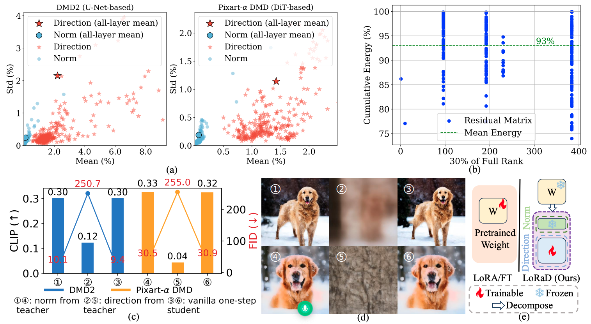
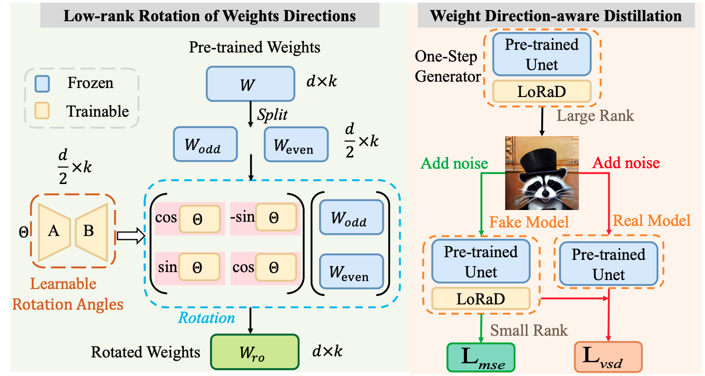
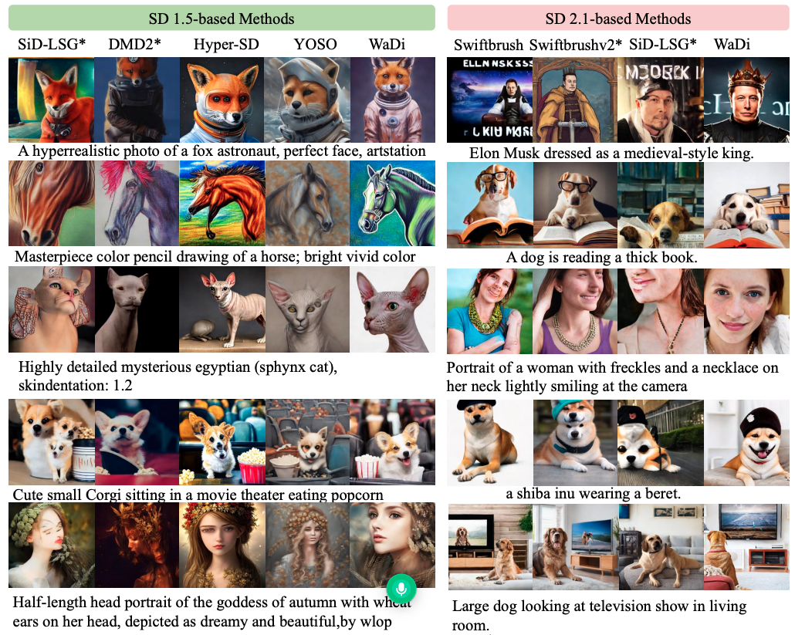
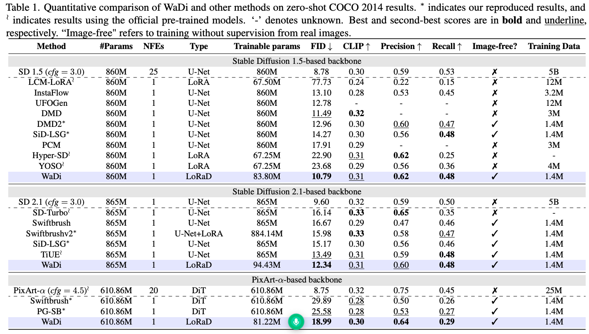

# 🚀 [CVPR 2026]WaDi: Weight Direction-aware Distillation for One-step Image Synthesis

<div align="center">

  <br>
  <em>
      Motivational analysis of our method. (a) Differences in weight norm and direction between the one-step student and the teacher
model. See Suppl. E for details and additional examples. (b) SVD analysis of the residual matrix for DMD2. (c) Replacing the one-step
model’s norm with that of the multi-step model has little effect (① ,④ ); replacing the direction severely degrades generation quality (② ,
⑤ ). (d) Qualitative examples corresponding to (c). (e) Illustration of LoRaD.
  </em>
</div>

## 📘 Introduction
Despite the impressive performance of diffusion models such as Stable Diffusion (SD) in image generation, their slow inference limits practical deployment. Recent works accelerate inference by distilling multi-step diffusion into one-step generators. To better understand the distillation mechanism, we analyze U-Net/DiT weight changes between one-step students and their multi-step teacher counterparts. Our analysis reveals that changes in weight direction significantly exceed those in weight norm, highlighting it as the key factor during distillation. Motivated by this insight, we propose the Low-rank Rotation of weight Direction (LoRaD), a parameter-efficient adapter tailored to one-step diffusion distillation. LoRaD is designed to model these structured directional changes using learnable low-rank rotation matrices. We further integrate LoRaD into Variational Score Distillation (VSD), resulting in Weight Direction-aware Distillation (WaDi)-a novel one-step distillation framework. WaDi achieves state-of-the-art FID scores on COCO 2014 and COCO 2017 while using only approximately 10% of the trainable parameters of the U-Net/DiT. Furthermore, the distilled one-step model demonstrates strong versatility and scalability, generalizing well to various downstream tasks such as controllable generation, relation inversion, and high-resolution synthesis.



<div align="center">
<em>(Left) Detailed architecture of the Low-rank Rotation of weight Direction (LoRaD) module. The LoRaD rotates the pre-trained
weight directions using learnable low-rank rotation angles. (Right) Overview of the Weight Direction-aware Distillation (WaDi) framework.
  </em>
</div>

## ✨ Qualitative results

<div align="center">
    <b>
            Quality results compared to other methods.
    </b>
</div>


## 📈  Quantitative results
<p align="center">
 
</p>

## Training

### Installation
```shell
# git clone this repository
https://github.com/gudaochangsheng/WaDi.git
cd WaDi

# create new anaconda env
conda create -n wadi python=3.8 -y
conda activate wadi

# install python dependencies
pip3 install -r requirements.txt
  ```
### train
```shell
# Train WaDi on Stable Diffusion 1.5
./train_dkd_sd1.5.sh

# Train WaDi on Stable Diffusion 2.1
./train_dkd_sd2.1.sh

# Train WaDi on PixArt-alpha
./train_dkd_pixart.sh
  ```

## Inference
coming soon

## Citation

```
@article{wang2026wadi,
  title={WaDi: Weight Direction-aware Distillation for One-step Image Synthesis},
  author={Wang, Lei and Cheng, Yang and Li, Senmao and Wu, Ge and Wang, Yaxing and Yang, Jian},
  journal={arXiv preprint arXiv:2603.08258},
  year={2026}
}

```
## Acknowledgement

This project is based on [Diffusers](https://github.com/huggingface/diffusers). Thanks for their awesome works.
## Contact
If you have any questions, please feel free to reach out to me at  `scitop1998@gmail.com`. 
