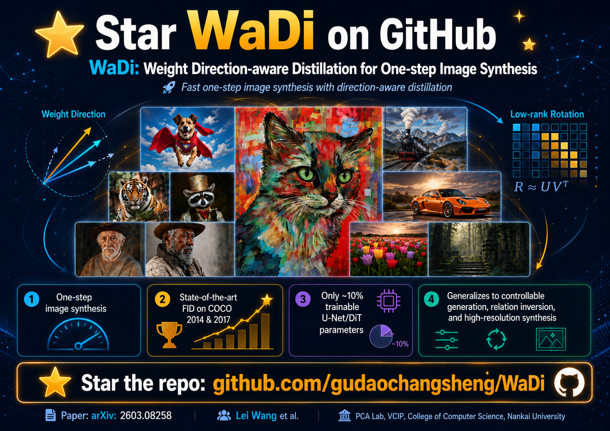
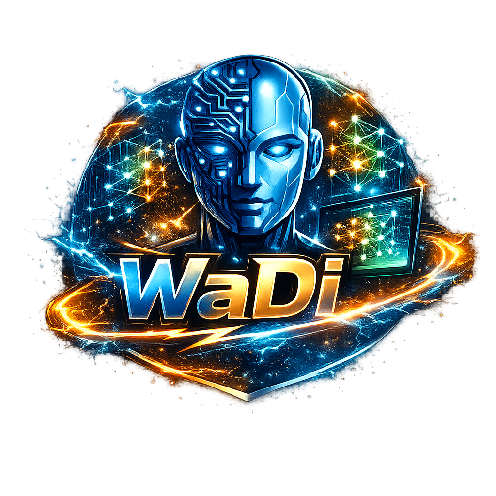
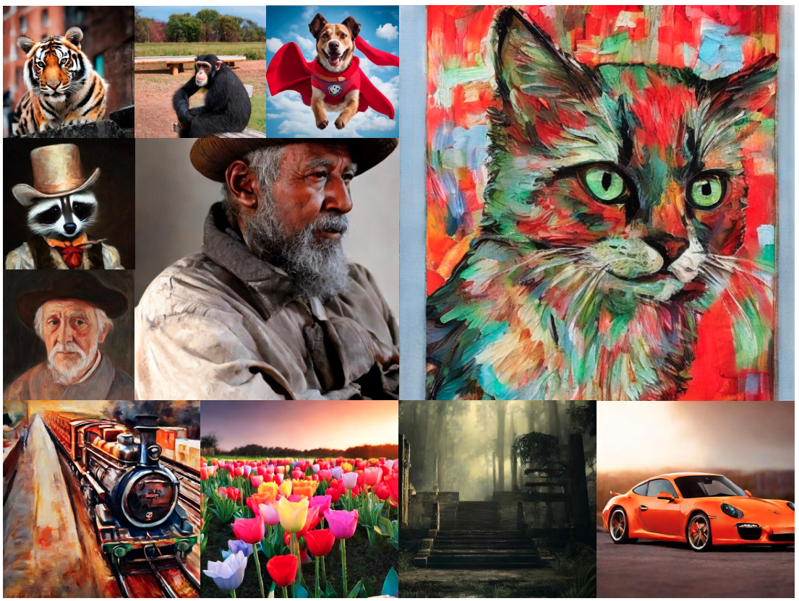
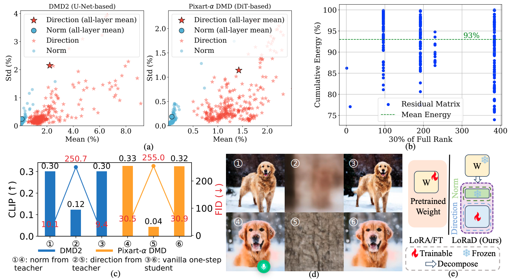
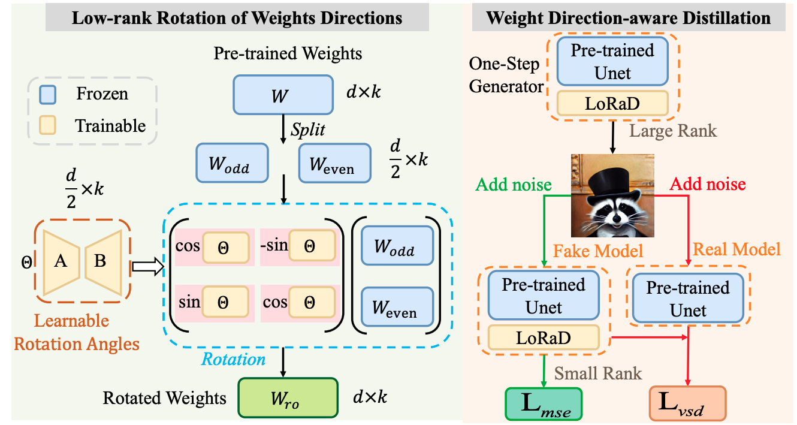
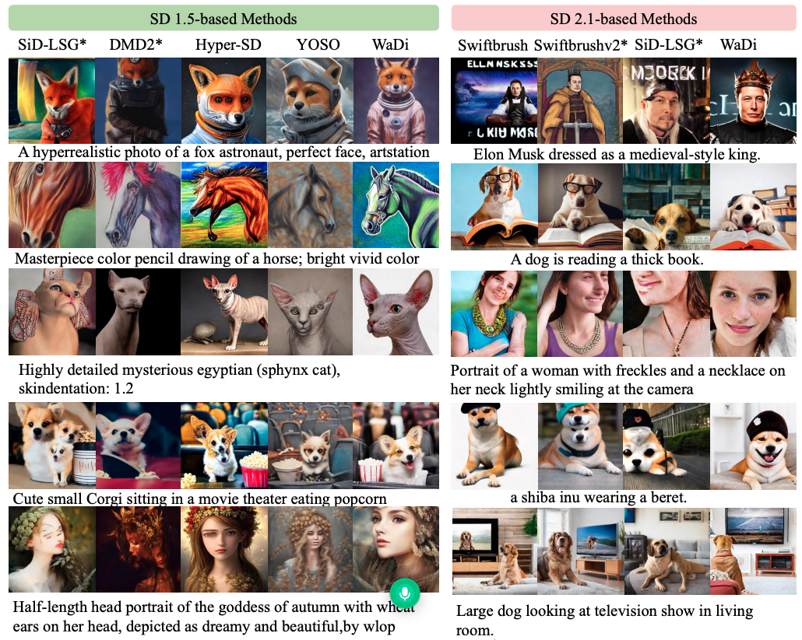
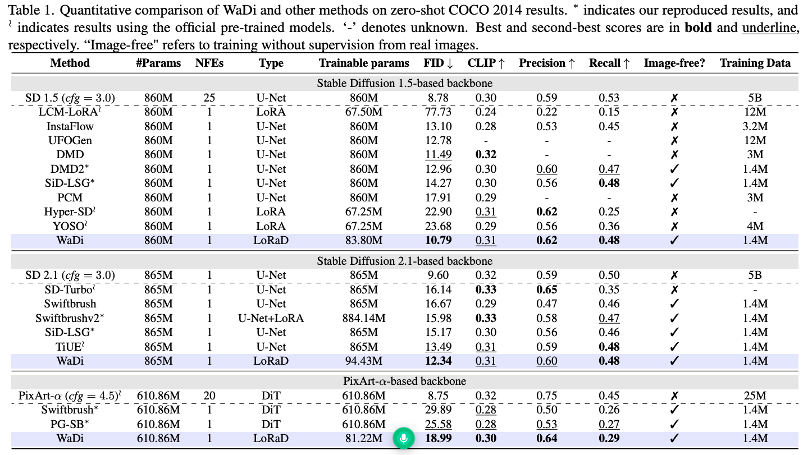

<p align="center">
  
</p>

<div align="center">
  
</div>


<h1 align="center">🚀 WaDi: Weight Direction-aware Distillation for One-step Image Synthesis</h1>

<h5 align="center"> If you like our project, please give us a star ⭐ on GitHub for the latest update.  </h2>

<p align="center">
  <b>CVPR 2026</b>
</p>


<div align="center">

<h2>🚀 Try WaDi Online</h2>
<a href="https://huggingface.co/spaces/gudaochangsheng/WaDi-1.5">
  
</a>

<br>

<table>
  <tr>
    <td align="center" width="560">
      <br>
      <a href="https://huggingface.co/spaces/gudaochangsheng/WaDi-1.5">
        
      </a>
      <br><br>
      <b>One-step image generation in your browser</b>
      <br>
      <sub>No installation · Online inference · WaDi-SD1.5</sub>
      <br><br>
    </td>
  </tr>
</table>

<br>


</div>


<!-- Paper / Project -->
<p align="center">
  <a href="https://openaccess.thecvf.com/content/CVPR2026/papers/Wang_WaDi_Weight_Direction-aware_Distillation_for_One-step_Image_Synthesis_CVPR_2026_paper.pdf">
  
</a>
  <a href="https://arxiv.org/abs/2603.08258">
    
  </a>
  <a href="https://arxiv.org/pdf/2603.08258">
    
  </a>
  <a href="https://gudaochangsheng.github.io/WaDi-Page/">
    
  </a>
  <a href="https://github.com/gudaochangsheng/WaDi">
    
  </a>
  
</p>

<!-- Models: Hugging Face -->
<p align="center">
  <a href="https://huggingface.co/gudaochangsheng/WaDi/blob/main/rotated_unet-sdv2-1.safetensors">
    
  </a>
  <a href="https://huggingface.co/gudaochangsheng/WaDi/blob/main/rotated_unet-sdv1-5.safetensors">
    
  </a>
  <a href="https://huggingface.co/gudaochangsheng/WaDi/blob/main/rotated_transformer.safetensors">
    
  </a>
</p>

<!-- Models: ModelScope -->
<p align="center">
  <a href="https://modelscope.cn/models/gudaochangsheng98/WaDi/file/view/master/rotated_unet-sdv2-1.safetensors?status=2">
    
  </a>
  <a href="https://modelscope.cn/models/gudaochangsheng98/WaDi/file/view/master/rotated_unet-sdv1-5.safetensors?status=2">
    
  </a>
  <a href="https://modelscope.cn/models/gudaochangsheng98/WaDi/file/view/master/rotated_transformer.safetensors?status=2">
    
  </a>
</p>

<!-- Media / Blogs -->
<p align="center">
  <a href="https://www.youtube.com/watch?v=j6CuQxynJcA">
  
</a>
<a href="https://www.youtube.com/watch?v=j6CuQxynJcA">
  
</a>
<a href="https://www.youtube.com/watch?v=j6CuQxynJcA">
  
</a>
  <a href="https://mp.weixin.qq.com/s/2wkWRmyaLMvAFLeyF0cVKQ">
    
  </a>
  <a href="https://zhuanlan.zhihu.com/p/2038304355946866536">
    
  </a>
  <a href="https://blog.csdn.net/wl1780852311/article/details/161194380">
    
  </a>
</p>


<p align="center">
  <a href="https://www.youtube.com/watch?v=j6CuQxynJcA">
    
  </a>
</p>

<p align="center">
  <a href="https://www.youtube.com/watch?v=j6CuQxynJcA">
    🎬 Watch Video Presentation
  </a>
</p>

<div align="center">
  <a href="https://gudaochangsheng.github.io/">Lei Wang</a><sup>1</sup>,
  <a href="https://gudaochangsheng.github.io/WaDi-Page/">Yang Cheng</a><sup>1</sup>,
  <a href="https://sen-mao.github.io/">Senmao Li</a><sup>1</sup>,
  <a href="https://github.com/Martinser">Ge Wu</a><sup>1</sup>,
  <a href="https://yaxingwang.github.io/">Yaxing Wang</a><sup>1,3†</sup>,
  <a href="https://scholar.google.com.hk/citations?user=6CIDtZQAAAAJ&hl=en">Jian Yang</a><sup>1,2†</sup>
</div>

<div align="center">
  <sup>1</sup> PCA Lab, VCIP, College of Computer Science, Nankai University &nbsp;&nbsp;
  <sup>2</sup> PCA Lab, School of Intelligence Science and Technology, Nanjing University &nbsp;&nbsp;
  <sup>3</sup> Shenzhen Futian, NKIARI
</div>

<div align="center">
  † Corresponding authors
</div>

---

## 🔥 Highlights

- **A simple but effective insight:** in one-step diffusion distillation, **weight direction matters much more than weight norm**.
- We propose **LoRaD** (**Lo**w-rank **Ra**tation of weight **D**irection), a parameter-efficient adapter for modeling structured directional changes.
- We build **WaDi**, a weight direction-aware one-step distillation framework based on **VSD**.
- WaDi achieves **state-of-the-art FID** on **COCO 2014** and **COCO 2017**.
- WaDi uses only **~10% trainable parameters** of the original **U-Net / DiT**.
- The distilled one-step model generalizes well to **controllable generation**, **relation inversion**, and **high-resolution synthesis**.

---

## 🖼️ Overview

<div align="center">
  
</div>

---

## 💡 Motivation

<div align="center">
  
  <br>
  <em>
    Motivational analysis of WaDi.
    (a) Differences in weight norm and direction between the one-step student and the teacher model.
    (b) SVD analysis of the residual matrix for DMD2.
    (c) Replacing the one-step model's norm with that of the multi-step model has little effect, while replacing the direction severely degrades generation quality.
    (d) Qualitative examples corresponding to (c).
    (e) Illustration of LoRaD.
  </em>
</div>

---

## 📘 Introduction

Diffusion models such as Stable Diffusion achieve impressive image generation quality, but their multi-step inference is still expensive for practical deployment. Recent works aim to accelerate inference by distilling multi-step diffusion models into one-step generators.

To better understand the distillation mechanism, we analyze the weight changes between one-step students and their multi-step teacher counterparts in both **U-Net** and **DiT** models. Our analysis shows that **directional changes in weights are significantly larger and more important than norm changes** during one-step distillation.

Motivated by this finding, we propose **LoRaD** (**Lo**w-rank **Ra**tation of weight **D**irection), a lightweight adapter that models structured directional changes using learnable low-rank rotation matrices. We further integrate LoRaD into **Variational Score Distillation (VSD)** and build **WaDi**, a novel one-step distillation framework.

WaDi achieves **state-of-the-art FID** on **COCO 2014** and **COCO 2017** while using only **~10%** of the trainable parameters of the original **U-Net / DiT**. In addition, the distilled one-step model remains versatile and scalable, supporting downstream applications such as **controllable generation**, **relation inversion**, and **high-resolution synthesis**.

---

## 🧠 Method

<div align="center">
  
  <br>
  <em>
    Left: architecture of the <b>LoRaD</b> module, which rotates pretrained weight directions using learnable low-rank rotation angles.
    Right: overview of the <b>WaDi</b> framework.
  </em>
</div>

---

## ✨ Qualitative Results

<div align="center">
  <b>Qualitative comparison with existing one-step distillation methods.</b>
</div>

<div align="center">
  
</div>

---

## 📈 Quantitative Results

<p align="center">
  
</p>

---

## 📦 Model Zoo

| Model | Architecture | Hugging Face | ModelScope |
|-------|--------------|--------------|------------|
| WaDi-SD2.1 | U-Net | [](https://huggingface.co/gudaochangsheng/WaDi/blob/main/rotated_unet-sdv2-1.safetensors) [](https://huggingface.co/gudaochangsheng/WaDi) | [](https://modelscope.cn/models/gudaochangsheng98/WaDi/file/view/master/rotated_unet-sdv2-1.safetensors?status=2) [](https://modelscope.cn/models/gudaochangsheng98/WaDi) |
| WaDi-SD1.5 | U-Net | [](https://huggingface.co/gudaochangsheng/WaDi/blob/main/rotated_unet-sdv1-5.safetensors) [](https://huggingface.co/gudaochangsheng/WaDi) | [](https://modelscope.cn/models/gudaochangsheng98/WaDi/file/view/master/rotated_unet-sdv1-5.safetensors?status=2) [](https://modelscope.cn/models/gudaochangsheng98/WaDi) |
| WaDi-PixArt | DiT | [](https://huggingface.co/gudaochangsheng/WaDi/blob/main/rotated_transformer.safetensors) [](https://huggingface.co/gudaochangsheng/WaDi) | [](https://modelscope.cn/models/gudaochangsheng98/WaDi/file/view/master/rotated_transformer.safetensors?status=2) [](https://modelscope.cn/models/gudaochangsheng98/WaDi) |

---

<a href="https://modelscope.cn/models/gudaochangsheng98/RefAlign-14B">
  
</a>

## 🛠️ Installation

```bash
git clone https://github.com/gudaochangsheng/WaDi.git
cd WaDi

conda create -n wadi python=3.8 -y
conda activate wadi

pip install -r requirements.txt
```

---

## 🏋️ Training

```bash
# Train WaDi on Stable Diffusion 1.5
bash train_dkd_sd1.5.sh

# Train WaDi on Stable Diffusion 2.1
bash train_dkd_sd2.1.sh

# Train WaDi on PixArt-alpha
bash train_dkd_pixart.sh
```

---

## 🎬 Inference

```bash
# Inference for Stable Diffusion models
python infer_sd_model.py

# Inference for PixArt-alpha
python infer_pixart.py
```

---

## 🔗 Related Projects

- [SwiftBrushV2 (unofficial implementation)](https://github.com/gudaochangsheng/SwiftBrushV2)

---

## 📚 Citation

If you find **WaDi** useful, please consider giving this repository a **star** ⭐ and citing our paper.

```bibtex
@InProceedings{Wang_2026_CVPR,
    author    = {Wang, Lei and Cheng, Yang and Li, Senmao and Wu, Ge and Wang, Yaxing and Yang, Jian},
    title     = {WaDi: Weight Direction-aware Distillation for One-step Image Synthesis},
    booktitle = {Proceedings of the IEEE/CVF Conference on Computer Vision and Pattern Recognition (CVPR)},
    month     = {June},
    year      = {2026},
    pages     = {5574-5584}
}

@inproceedings{li2025one,
  title={One-Way Ticket: Time-Independent Unified Encoder for Distilling Text-to-Image Diffusion Models},
  author={Li, Senmao and Wang, Lei and Wang, Kai and Liu, Tao and Xie, Jiehang and van de Weijer, Joost and Khan, Fahad Shahbaz and Yang, Shiqi and Wang, Yaxing and Yang, Jian},
  booktitle={IEEE Conference on Computer Vision and Pattern Recognition (CVPR)},
  year={2025}
}
```

---

## 🙏 Acknowledgements

This project is built upon [Diffusers](https://github.com/huggingface/diffusers).  
We also sincerely acknowledge the inspiring prior work:
[TiUE](https://github.com/sen-mao/Loopfree) and [SwiftBrush](https://github.com/VinAIResearch/SwiftBrush).

---

## 📮 Contact

If you have any questions, please feel free to contact: `scitop1998@gmail.com`
